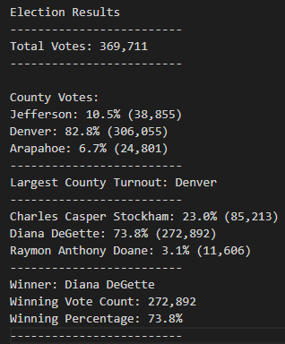
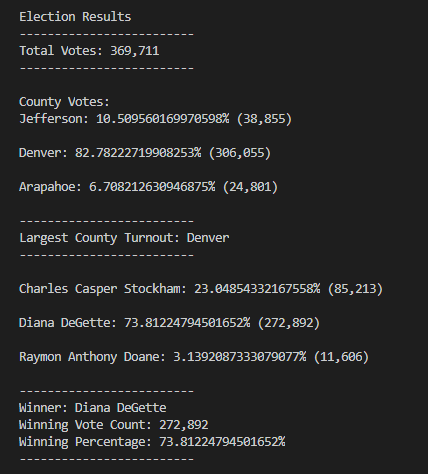
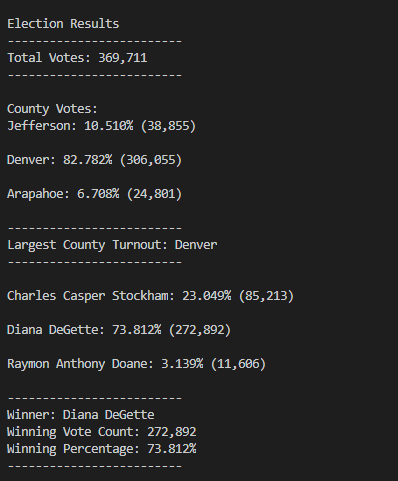

# Election Analysis: _Votes are in!_
## Overview of Project

Contracted by Colorado’s Board of Elections to complete the audit of a recent local congressional election.

**Tasks included:**

1.	Evaluate the number of votes cast
2.	Compile a complete list of candidates who received votes
3.	Evaluate the total number of votes each candidate received
4.	Evaluate the percentage of votes each candidate won
5.	Determine the winner of the election based on popular vote

## Resources
* Data Source: election_resuts.csv
* Software: Python 3.7.6 64-bit, Visual Studio Code, 1.52. 1

## Summary Analysis: _By the Numbers_
Analysis of the election illustrated the following ( as seen in image on the right): 
* There were _**369,711**_ votes cast in the election.

### _By Canditate_
* The candidates _were_:
   * Charles Casper Stockham
   * Diana DeGette 
   * Raymon Anthony Doane

* The Candidates results _were_:
    * Candidate Charles Casper Stockham received **23.0%** of the  vote and **85, 213** number of votes .

    * Candidate Diana DeGette received **73.8%** of the  vote and **272,892** number of votes.

    * Candidate Raymon Anthony Doane received **3.1%** of the  vote and **11,606** number of votes.

* The Winner of the election _was_:
    * Candidate Diana DeGette who received **73.8%** of the vote and **272,892** number of votes.

### _By County_
 * The _largest_ voter turnout was from **Denver County**, recieveing **82.8%** of the votes and **306,055** number of votes.

 * With **10.5%** of the votes and **38,855** votes, _**Jefferson County**_ came in second place in the voter turnout tabulation. 

 * Lastly, _**Arapahoe County**_ with  **6.7%**  of the votes and **24,801** of the number of votes fell third in the voter turnout tabulation by county. 
 
## Election Audit Summary
While the attached script allowed for votes to be tabulated to showcase the election turnout per candidate and county of _this_ election, the use of the script can be implemented in future election audits, even if the county and candidate count in correlation to district changes. This makes for a more time efficient and convenient practice to pull election data and make appropriate analysis.  

### Alterative Analysis
If need be the script can be altered to only include the results by county or candidate, exclusively. This can be done by simply *removing* the script used to calculate either county or candidate results, respectively.

As seen below, by removing the candidate calculations, the results by county would only be printed. 

Another, option to audit analysis is to view the percentage of votes per candidate and county as an unrounded number or rounded to specific decimal point. This would prove rather useful if there was ever a close election or recount to which determining the winning candidate was even more crucial and literally relied on the very last number, i.e., hundredth or thousandth of percentage.

To accomplish this simply edit the script where it reflects the decimal places, (the current ":.1f" reflects a rounded number of one decimal place) to round to or show as unrounded as seen below: 

*    **Unrounded Numbers**: Replace ":.1f" to ":," in {tally_percentage:}, {tally:}, {vote_percentage:}% ({votes:}

    tally = county_votes.get(county_name)
    tally_percentage = float(tally) / float (total_votes) * 100
        county_results = (
            f"{county_name}: {tally_percentage:,}% ({tally:,})\n") 

    votes = candidate_votes.get(candidate_name)
    vote_percentage = float(votes) / float(total_votes) * 100
        candidate_results = (
            f"{candidate_name}: {vote_percentage:,}% ({votes:,})\n")

  <i><b>Results printed: Unrounded numbers</b></i> 
 

  

***

*   **Rounded Numbers**: Replace ":.1f" to ":.3f" in {tally_percentage:}, {tally:}, {vote_percentage:}% ({votes:}. 

        tally = county_votes.get(county_name)
        tally_percentage = float(tally) / float (total_votes) * 100
        county_results = (
            f"{county_name}: {tally_percentage:.3f}% ({tally:.3f})\n") 

        votes = candidate_votes.get(candidate_name)
        vote_percentage = float(votes) / float(total_votes) * 100
        candidate_results = (
            f"{candidate_name}: {vote_percentage:.3f}% ({votes:,})\n")

  <i><b>Results printed: Rounded votes to three decimal places</b></i> 
 

    

  

